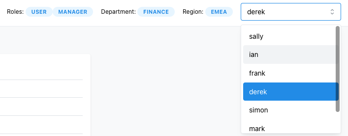
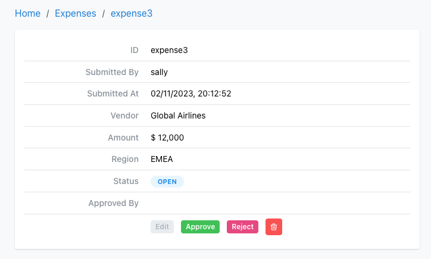
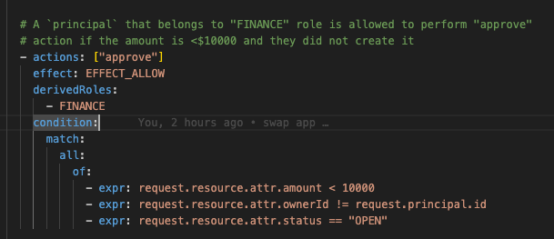
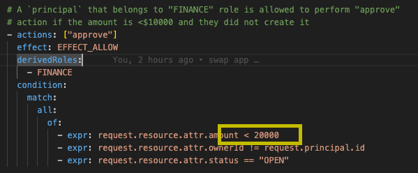
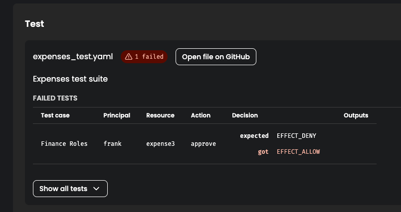
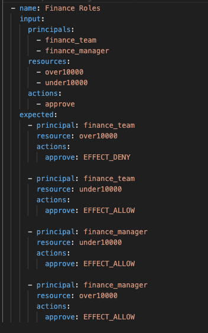
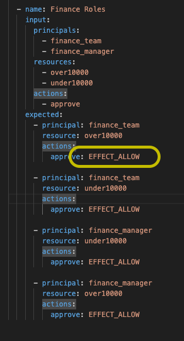
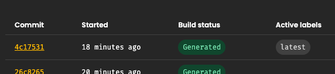
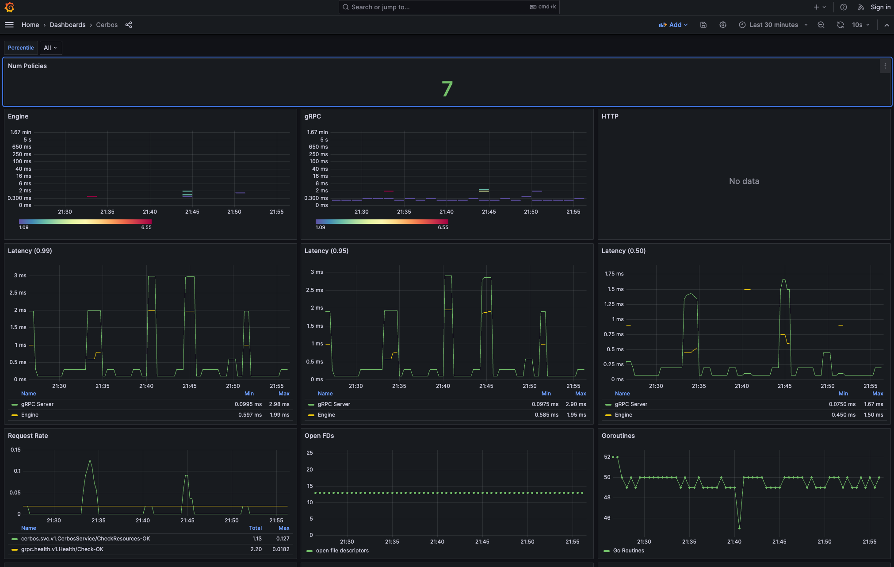

# Demo Expenses Application

<!-- ## Architecture -->

<!--
 -->

## Getting Started

There is a `.env.example` file under under `infra/docker/` path of the project that you need to copy and rename to `.env` and add your Cerbos Hub variables to.

```sh
# .env
CERBOS_HUB_CLIENT_ID=your_cerbos_hub_client_id
CERBOS_HUB_CLIENT_SECRET=your_cerbos_hub_client_secret
CERBOS_HUB_WORKSPACE_SECRET=your_cerbos_hub_workspace_secret
CERBOS_HUB_WASM_BUNDLE_URL=your_cerbos_hub_wasm_bundle_url
```

### Start App and Infra (Cerbos, Postgres, Promethesus, Jeager, Grafana)

```
make start
```

### To reset all the infrastructure components (Cerbos, Promethesus, Jeager, Grafana)

`make reset`

### To reset the database click "Reset database" in the UI

To reset the database click "Reset database" in the UI

#### Service List

- App [http://localhost:9980](http://localhost:9980) - Expenses app
- Grafana [http://localhost:3000](http://localhost:3000) - Cerbos metrics (goto Cerbos dashboard)
- Jeager [http://localhost:16686](http://localhost:16686) - Request tracing

When the application fires up the database is reset and seeded so it is a clean slate.

### Demo Story

- Expenses tracking application
  - Node backend
  - React frontend
  - Cerbos PDP connected to Hub
  - Cerbos Embedded PDP loaded into browser
- Differnt sections of the app based on role (switch users)
- Go into expesnes section and switch user - see results are different (query plan)
- We are going to focus on the Finance department
  - Frank as the role of User
  - Derek has the roles of User and Manager



- Business logic says that Frank can only approve up to $10,000 but Derek can do unlimited
- Go into Global Airlines expense for $12,000 (`expense3`) and switch between Derek and Frank - the Approve/Reject buttons will be enabled for Derek, but not Frank



- The debugger window shows the check for `view` is done on the server, but `approve` check is done on client (via WASM)
- Business logic needs to update this $10,000 limit to less than $20,000
- In the repo, edit `cerbos/policies/resource_expense.yaml` line 85 change `- expr: request.resource.attr.amount < 10000` to `- expr: request.resource.attr.amount < 20000` and commit and push the change

  Before

  

  After

  

- [View the builds](https://hub.cerbos.cloud/app/workspace/5LGZESAFI2TM/builds) in the UI and the tests have failed



- Open the `cerbos/policies/expenses_test.yaml` file and fix the test - line 240 should now be `EFFECT_ALLOW`

  Before

  

  After

  

- Commit and push the change
- [View the builds](https://hub.cerbos.cloud/app/workspace/5LGZESAFI2TM/builds) in the UI and the tests have passed and both PDP and Embedded are build



- Back in the expenses app reload the `expense3` and switch between Derek and Frank - both should be able to press Approve/Deny

### Optional steps

#### Monitoring via Graphana

[Open](http://localhost:3000/d/fL0WClBnz/cerbos?orgId=1&refresh=10s)



#### Jaeger Tracing

[Open](http://localhost:16686/search?operation=checkResource&service=expenses-api) and click on a span


## Development

### Start Server

```
cd server
npm install
npm run dev
```

### Start Client

```
cd client
npm install
npm run dev
```
